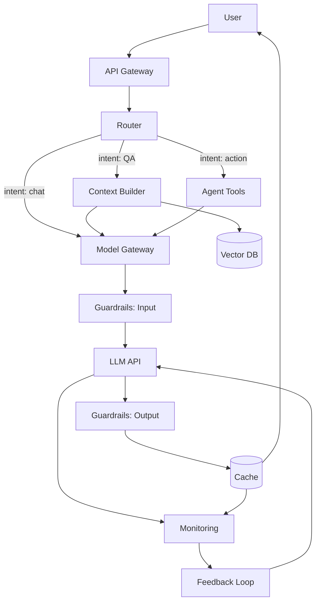

# Архитектура AI-приложения

```mermaid
flowchart TD
    U[User] --> GW[API Gateway]
    GW --> R[Router]
    R -->|intent: QA| CB[Context Builder]
    R -->|intent: chat| MG[Model Gateway]
    R -->|intent: action| AG[Agent Tools]
    CB --> VDB[(Vector DB)]
    CB --> MG
    AG --> MG
    MG --> GR_IN[Guardrails: Input]
    GR_IN --> LLM[LLM API]
    LLM --> GR_OUT[Guardrails: Output]
    GR_OUT --> CACHE[(Cache)]
    CACHE --> U
    LLM --> MON[Monitoring]
    CACHE --> MON
    MON --> FB[Feedback Loop]
    FB --> LLM
```
